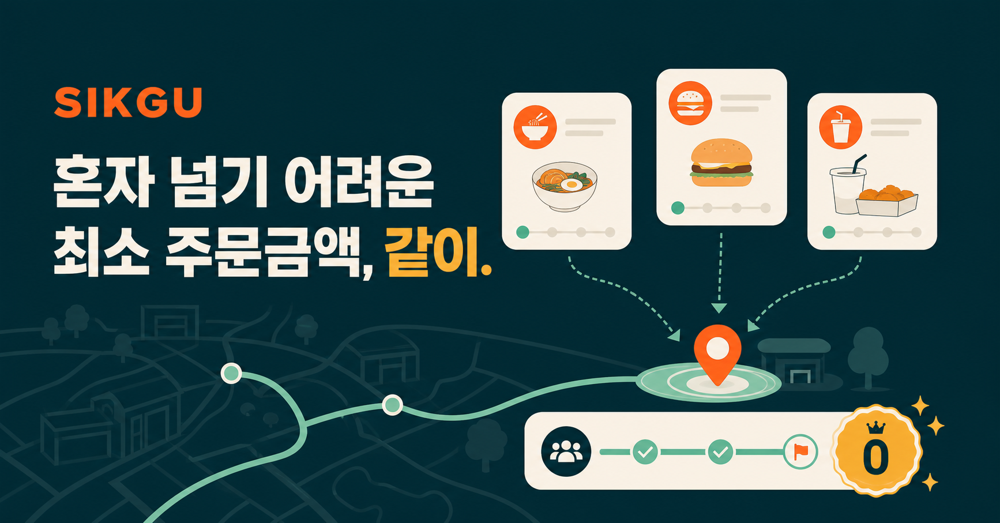

# SIKGU 식구 — 혼자 넘기 어려운 최소 주문금액, 같이.

Group food-delivery coordination for the DGIST campus. Students choose a nearby restaurant and pickup point, gather an order, and coordinate privately before the host orders through Baemin or Coupang Eats.



## How it works

1. **Open a room:** choose one of 21 restaurants, one of 8 campus pickup points, a server-timed 20 / 30 / 45 minute recruitment period, capacity of 2–8 people, and an optional note (menu, meeting time).
2. **Gather members:** request approval or accept a host's invitation. Approval, capacity and recruitment deadlines are checked inside the database write. Removed members cannot reuse an invitation to bypass the host's decision. A pending requester can cancel, sees the room under My Rooms, and sees “거절됨” after a rejection (they may ask again). The host can close recruitment early, or extend it by 15 minutes up to twice until 10 minutes after the deadline.
3. **Pool amounts:** each approved member enters what they will order; the room total is the sum, kept in the same database write as every amount or membership change. The host can enter an amount for a member. Nobody types the pooled total by hand.
4. **Compare ordering apps:** each app shows its own minimum, remaining amount and estimated delivery fee. Membership benefits apply to that app only. For example, Sinjeon with ₩15,000 pooled meets Baemin's stored minimum, while Coupang still needs ₩3,000, even with Coupang membership. Confirm current prices and benefits in the delivery app before ordering.
5. **Coordinate privately:** the host records the final paid total and expected arrival and shares a receipt. Approved members use the room chat. Chat, amounts and receipts stay available for 30 days after recruitment closes. Retained rooms and older messages have “load more” controls. A deleted room or a removal closes the room view with a plain message.

This app coordinates orders; it does not place delivery orders, collect payments or calculate individual settlements.

## Invitations, history and privacy

- Invitation expiry is bounded by the room's recruitment deadline. A full room, removal or deletion can make a link unusable sooner. Hosts can recover an existing usable link when the five-link limit is reached, including after a refresh.
- Invite credentials leave the URL before the initial API request. A pending invitation requires confirmation showing the current account and room, including after sign-in or a failed initial load.
- Public browsing supports server-side filters and pages of up to 100 rooms. My Rooms uses 50-room pages; chat uses 200-message pages. Equal timestamps use an ID tie-breaker. Polling pauses in hidden tabs, backs off after errors and stops when its component unmounts.
- Names are masked (김*수, Jonathan S.; accounts without a profile name keep a distinct `User-XXXXXX` label) and email addresses are not serialized to other users. Private chat and receipts require current approved membership on every read. Chat writes recheck membership at the SQL boundary. Join requests are limited to ten per user per ten minutes. The profile view carries the privacy notice.
- Receipts are re-encoded in the browser and validated/sanitized on the server: PNG only, metadata stripped, CRC checked, with size and pixel limits.
- Access to retained rooms ends 30 days after recruitment closes. Physical deletion is **best-effort**, driven by feed traffic; it can happen later. See [RUNBOOK.md](RUNBOOK.md) for cleanup limits and monitoring.

## Development and verification

Requires Node.js ≥22.13 to run and ≥22.18 to run the tests (the API harness imports TypeScript directly). Use the versions pinned by `package-lock.json`.

```bash
npm ci
npm run dev -- --host 127.0.0.1 --port 3000
npm test                    # production build, TypeScript, Node/SQLite tests
npm run lint
npx playwright install chromium
npm run test:browser        # real UI, local synthetic API responses (starts the dev server on port 3000)
npm audit --omit=dev        # production dependencies: CI fails on high or critical
npm audit --json            # development entries are reviewed in REPAIRS.md
npm run probe -- https://<origin>   # identity boundary probe against a deployed origin
npm run db:generate -- --name descriptive_change
```

Local Vite development provides simulated D1 and R2 bindings without a Cloudflare account. The authentication proxy is not simulated by these bindings. Behavioral API tests use request-local synthetic identities and the real SQL against SQLite; browser tests intercept only the local API. Neither proves the production identity boundary or live D1 concurrency.

The latest repair results, before/after reproductions, package audit and deployment limitations are in [REPAIRS.md](REPAIRS.md) and [verification/](verification/). Browser coverage includes the 201st/202nd chat messages, retained history, failed sends, stale search responses, invitation confirmation, Korean IME, focus restoration, and 360px/390px layouts with enlarged text. Physical iOS testing remains outstanding.

## Architecture

| Layer | Implementation |
| --- | --- |
| UI | React 19, vinext (Next.js on Cloudflare Workers), CSS/Tailwind 4 |
| Database | D1 / SQLite, Drizzle schema and generated migrations |
| Files | R2 private receipt objects |
| Identity | Platform-injected Sign in with ChatGPT headers |
| Verification | Node/SQLite tests, deterministic scheduler tests, Playwright Chromium |

```text
app/
  page.tsx                 # Home: composes hooks, views and modals (under 300 lines)
  hooks/                   # use-feed (pools, cursors, poll, server clock), use-session,
                           # use-room-actions (join, cancel, create, invite), use-current-pickup
  views/                   # home, restaurants, profile (with privacy notice), right rail
  modals/                  # pool, create, campus map, feedback, invite confirmation
  components/              # brand, header, location picker, pool card, progress, map preview
  lib/api.ts               # apiGet/apiPost with the same-origin header and 401 → sign-in
  lib/pool-status.ts       # join-status labels, full/closed checks, merge by id
  continuations.ts         # pending join and pending invitation resumption after sign-in
  room-hub.tsx             # private room: members and amounts, deadline actions, chat, receipt
  room-ui.tsx              # dialog lifecycle, receipt re-encoding, polling adapter, readJson
  name-mask.mjs            # display-name masking (Korean middle, Latin initials, placeholders)
  catalog.ts, types.ts      # preserved restaurant/pickup data and shared UI types
  polling.mjs              # cancellable scheduler shared by feed and room
  message-history.mjs      # message identity and history merging
  invite-continuation.mjs   # URL scrubbing and pending invitation validation
  order-estimates.mjs      # per-app minimum and delivery calculations
  api/sikgu/
    route.ts               # dispatcher: parses the action and delegates
    shared.ts              # identity, limits, D1 retry, room serialization
    feed.ts                # bootstrap feed and private room read
    rooms.ts               # room creation, membership, amounts, deadline changes
    chat.ts                # rate-limited message insert
    receipts.ts            # order-info PUT, room DELETE, receipt GET and R2 cleanup
    lock.ts                # fenced room mutation token
    retention.ts           # 30-day sweep of expired rooms
    invites.ts             # host-only invite creation and recovery
    pagination.ts          # bounded cursor validation and ordering
    responses.ts           # private responses, tokens, SQL clock expression
  chatgpt-auth.ts           # trusted proxy identity parsing
  sikgu-rules.mjs           # shared constraints and restaurant minimums
  receipt-image.mjs         # receipt sanitization
build/                     # Sites packaging and build-module evidence
worker/                    # Worker entry and browser security headers
db/, drizzle/              # schema and generated migration history
tests/, browser-tests/     # behavioral and supplementary structural checks
```

## Hosting and operations

`.openai/hosting.json` declares `DB` and `UPLOADS`; the Sites platform provides authentication routes and bindings. A GitHub push alone is not evidence of a Sites release.

**Production (2026-10-06):** commit `e42a53c` (merge of the completion-plan branch) is live as Sites version 28 at `https://sikgu-dgist.ugrp44group.chatgpt.site`. Migration `0006_member_amounts_and_extensions` was applied; `room_members.amount` and `rooms.extensions` exist in production. The health endpoint reports `database: "ok"` and `storage: "ok"`, and the scripted identity probe passed all three checks (`verification/identity-probe-2026-10-06.log`). Previous: `e5e77d7` as version 26 on 2026-10-05 (`verification/production-probe-2026-10-05.log`). See [COMPLETION.md](COMPLETION.md) for the owner steps that remain before `v1.0.0`.

**Before each release:** re-run the identity probe, confirm no alternate origin bypasses Sites, check migrations through the Sites Database view, and verify receipt storage. The health endpoint checks database connectivity only.

[RUNBOOK.md](RUNBOOK.md) covers release, rollback, catalog updates and cleanup. [REPAIRS.md](REPAIRS.md) is the repair record, closed on 2026-10-06; [COMPLETION.md](COMPLETION.md) is the fixed completion plan with its remaining owner steps; [AUDIT.md](AUDIT.md) preserves the earlier audit as history rather than certifying the present deployment.
